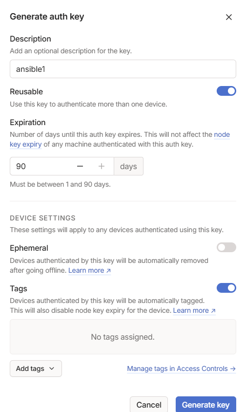

# Tailscale

## Overview

This playbook will automatically enroll the devices in the inventory into the default tailnet.

## Keys

There are 3 types of keys:

- node key
- auth key
- api key

The vault contains an auth key. The max expiry time for that key is 90 days.
We assume all throughout that 90 days is used.

## Scope

This is applicable to VMs or bare metal.

## Auth key creation

Go to https://login.tailscale.com/admin/settings/keys and create the key.

The creation menu should look like this:



## Renewing auth key

Revoke the previous key, create a new one.

Now edit the ansible vault and replace the new one and the creation date.

```
ansible-vault edit vault.yml
ansible-vault view vault.yml
```

## Enrolling a device

Enroll the t100ta tablet:

```
ansible-playbook -i ~/t100ta/arch/inventory ts-enroll.yml --ask-vault-pass
```

Enroll proxmox nodes:

```
ansible-playbook -i ~/code/tf/dcrawl/inventory ts-enroll.yml --ask-vault-pass
```

## Removing a device

Enroll the t100ta tablet:

```
ansible-playbook -i ~/t100ta/arch/inventory ts-dropout.yml --ask-vault-pass
```

## Out of scope for tailscale playbooks

LXC is out of scope.

OOB with this playbook, tailscaled will complain about the `tun` module and in the logs, you will see how it's trying to load
it from the host's kernel path which is obviously wrong.

https://tailscale.com/kb/1130/lxc-unprivileged

# SSL

## Generate self-signed root CA with mkcert

Install [mkcert](https://github.com/FiloSottile/mkcert) (used 1.4.4) and generate rootCA.

```
sudo apt-get install mkcert
mkcert -install
```

Now generate a wildcart SSL certificate for the homelab domain:
```
mkcert perm1.local "*.perm1.local" perm1.remote "*.perm1.remote"
```

You'll see the following certificates:

```
user@perm1:~/ssl$ ls
perm1.local+3-key.pem  perm1.local+3.pem
```

## Using the certificates in nginx

Place the wildcard cert generated above in `/etc/ssl/certs/perm1.local+3.pem`.

Place the key for the cert in `/etc/ssl/private/perm1.local+3-key.pem`.

Now you can use these inside nginx configs.

## Installing certificate on a Windows device

```
Installing cert on Windows 10/11
Win+R mmc (microsoft management console)
File > Add/Remove Snap-in
Click Certificates and Add
Select "Computer Account" and click Next
Select Local Computer and click Finish
Click OK
Double-click Certificates (local computer) and expand the view
Select Trusted Root Certification Authorities, right-click Certificates in the middle column under "Object Type" and select " All Tasks" and "Import"
Click Next then Browser, change to All Filese, select the .pem and click Open, then Next
```

## Installing certificate on a Linux device

```
ansible-playbook -i ~/t100ta/arch/inventory ssl-add.yml
```

## Removing certificate on a Linux device

```
ansible-playbook -i ~/t100ta/arch/inventory ssl-remove.yml
```
